# HomeGrow
Homegrow is a hydroponics system utilizing IBM's AI and Cloud technology alongside a raspberry pi and sensors to automate the farming process. 

The product is designed to be space-efficient, water-efficient, and easy to use for farms in LEDC's without reliable access to water.

## Table of contents
1. [Overview of Design](#Overview)
    1. [Bill of Materials](#Bom)
2. [Physical Build](#Build)
3. [Hardware](#Hardware)
4. [Database](#Database)
    1. [Mnesia](#Mnesia)
    2. [Cloudant](#Cloudant)
5. [User Interface](#UI)
    1. [Importing the Flow](#Flow)
    2. [Farm Status Displays](#Displays)
    3. [Notifications](#Notifications)
    4. [Chat](#Chat)
    5. [Custom Types](#Custom)
    6. [Connection Status](#Connection)
    7. [CSS](#CSS)
6. [Voice Assistant](#Assistant)
7. [Integration](#Integration)
    1. [Database <-> Pi](#D2P)
    2. [Database <-> Node-red](#D2N)
    3. [UI <-> Voice Assistant](#U2V)
8. [Sustainability and Ethical Report](#Sustainability)
9. [Future Work](#Future)
10. [Meetings Minutes](#Meeting)

## Overview of Design <a id="Overview"></a>
<br/>
<p align="center">
    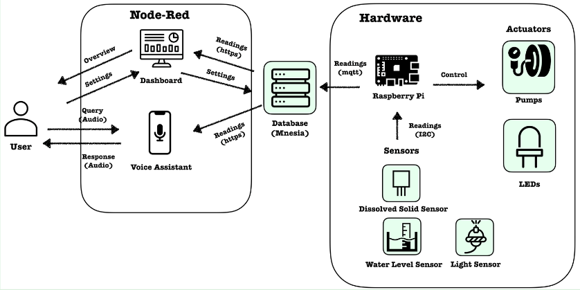
</p>

### Bill of Materials <a id="Bom"></a>
| No.  | Description | Price per Unit (£) | Quantity | Total Price (£) |
| ------------- | ------------- | ------------- | ------------- | ------------- |
| 1  | Black Downpipe 2.5m 68mm | 6.81 | 2 | 13.62 |
| 2  | Half Round 92.5 Degree Offset Bend | 3.26 | 8 | 26.08 |
| 3 | Round Pipe Branch 68mm | 6.70 | 5 | 33.50 |
| 4 | SEN0244 Gravity Analog TDS Sensor | 11.56 | 1 | 11.56 |
| 5 | Water Detection Sensor | 1.91 | 1 | 1.91 |
| 6 | SI1145 Light Sensor | 9.74 | 1 | 9.74 |
| 7 | LED Lights | 9.12 | 4 | 36.48 |
| 8 | Immersible Water Pump | 9.01 | 1 | 9.01 |
| 9 | Peristaltic Pump | 24.43 | 1 | 24.43 |
| 10 | Reservoir | 31.72 | 1 | 31.72 |
| 11 | Raspberry Pi Zero | 14 | 1 | 14 |
| 12 | Rockwool | 4.95 | 1 | 4.95 |
| 13 | Seeds | 1.50 | 1 | 1.50 |
| 14 | Analogue-to-Digital Converter| 14.10 | 1 | 14.10 |
| | | | | 232.60 |

## Physical Build <a id="Build"></a>
<p align="center">
    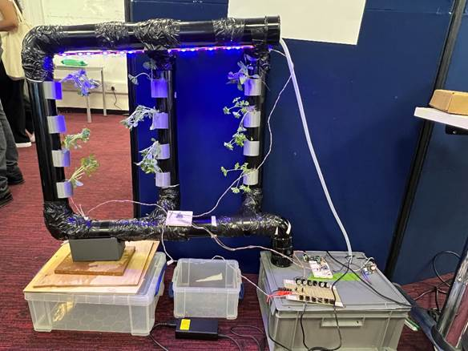 <br>
    Picture of the Farm <br>
    
    
</p>
The system is built using UPVC pipes and putting them in the given configuration in first picture. The lower end of the pipe system is then directed towards a water reservoir which would be the main reservoir for the system's water requiring operations. The reservoir contains the Raspberry Pi and the Mosfet system that is aimed to amplify the required control voltages from 3.3V Raspberry Pi output to each of the electronic items (i.e pumps, LEDs, Sensors) desired operating voltages. Inside the reservoir is the water pump that is tasked to supply the system with water whenever the water sensor detects the water level in the system is low. This motor and sensor are controlled through the GPIO pins present on Raspberry Pi. The nutrients rest in a different container than the main reservoir. The nutrient sensor placed in the main reservoir takes nutrient PPM values as a percentage value and below a certain threshold - specialized for each plant - triggers a second peristaltic pump to pump nurtients from the second container to the reservoir. The whole process is again controlled by the GPIO pins of the Raspberry Pi.<br>
<p align="center">
    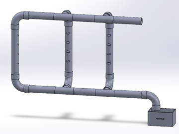 
    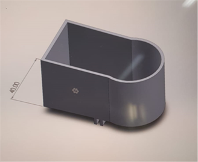 <br>
    &emsp;Schematic for Physical System of the Farm &emsp;&emsp;&emsp;&emsp;&emsp;&emsp;&emsp;3D-Printed Plant Holder <br>
    </p>
In the given arrangement of the pipes LED strips have been put directly on top with a slight angle for each plant to receive as much light as possible in a vertical design. On top of the bottom pipe is a UV sensor which detects values of light emitted from LEDs and customizes it for each plants needs. On the top section of pipes the hose from the main reservoir is attached and sealed with the given 3D printed pipe stopper. On the top layer joints 3D printed water level barriers have been installed to let the water level rise until it can go through the vertical pipes to slow down water and have a controlled current.The vertical pipes have wholes been cut each having 4 holes of dimensions 5x5.1 cm each. The 3D printed plant holders are then placed inside these wholes. The meshed design of the plant holders slow down the dripping water just enough for plants to be submerged without creating any blockages in the system.
<p align="center">
    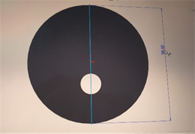 
    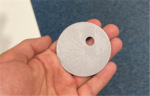<br>
    3D-Printed Pipe Stopper&emsp;&emsp;&emsp;&emsp;&emsp;&emsp;&emsp;3D-Printed Water Level Barrier <br><br>
 </p>

## Hardware <a id="Hardware"></a>
<p align="center">
    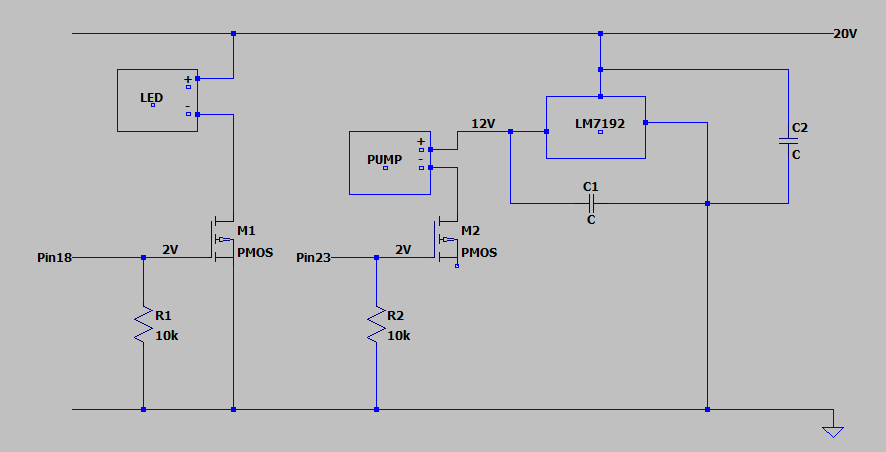<br>
    The Circuit Diagram
</p>
The image above shows the circuit for control over the hardware components. A laptop battery pack is used to provide a 20v dc power supply from mains power. Since the horticulture led strips require a 20v supply, they are connected directly to the voltage rail. The pumps require a lower input voltage of 12V so the LM7912 voltage regulator is connected which takes the input voltage and produces a very stable 12v supply for the pumps. All components need to be controlled by signals from the raspberry pi, to achieve this a mosfet is used with a gate threshold of approximately 2v. The raspberry pi can provide this voltage and turn on each component as required.

## Database <a id="Database"></a>
2 databases are used, an Mnesia database and a Cloudant database.

The database for the system uses [Mnesia](https://erlang.org/doc/man/mnesia), which allows for effortless data distribution and synchronisation between multiple servers. This is exposed to the front end and the embedded microcontrollers in each hydroponic system using HTTPS and MQTT respectively.

Each of the 3 systems runs as a supervised and fault-tolerant Erlang application on its own OTP Node within its own locked-down UNIX user account, with only necessary permissions within the host system, which allows for each subsystem to run in full isolation, as well as for increased security.

### Database
The database application is an Erlang [generic server](https://erlang.org/doc/man/gen_server), and is a relational database. There are 3 main tables in the database: `user`, which stores a registered user of our services and their hashed authorisation/password; `system`, which stores each hydroponic system, what it is growing, its owner, and the led/pump configuration; and `reading`, which stores each sensor reading from a hydroponic system. There is also a `plant` table for storing default settings and names for each type of plant a user may be growing in their system.
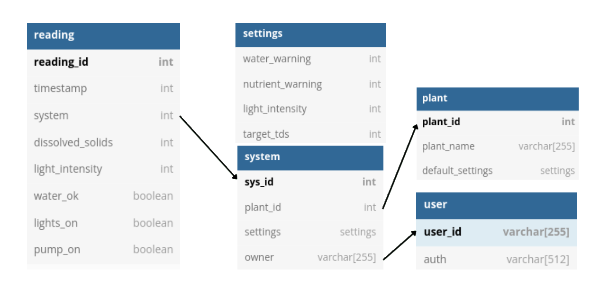

The generic server receives "calls" (messages which expect a response) and casts (asynchronous messages which don't expect a response) from either the MQTT app or the HTTPS app and performs transactions on the database accordingly. These messages can take the following form:

Description                        | Format | Response
------------------------------------ | --------------------- | ----------
Check password matches for a user | `{check_auth, :User:, :Pass:}` | `authorised` or `not_authorised`
Register a user | `{register, :User:, :Pass:}` | `{error, name_in_use}` or `ok`
Get the latest reading of a given type | `{:Reading:, #{id := :Id:, user := :User:}}` | `{error, no_sysid}` or `ok`
Get data matching parameters | `{get_data, #{since := :S:, before := :B:, count := :C:, id := :Id:, user := :User:}}` | `{ok, :Readings:}`
Claim a system | `{claim, :User:, :SysId:}` | `{201, ""}` or `{409, ""}`
Add a reading | `{reading, {:ReadingType:, :SerialNumber:}, :Reading:}` | none

### HTTPS
The HTTP endpoints can be found in the [OpenAPI documentation](ai-hydroponics.json). A tool such as the [42Crunch VSCode extension](https://marketplace.visualstudio.com/items?itemName=42Crunch.vscode-openapi) can be used to view the endpoints and even send sample requests to the server.

The server operates through the Inets application distributed as part of the Open Telecom Platform. A custom callback module is used to process the HTTP requests, decoding them  and then sending the processed requests such as authorisation and the actual request to get data on to the database server. The same callback module then formats the responses using the "Jiffy" library, sets the appropriate headers and sends the response back to Inets.

HTTPS was chosen over HTTP for the HTTP server due to the handling of users' passwords and potentially other sensitive data, as it would be unwise for this to be travelling unencrypted even between 2 private servers. Certbot/Let's Encrypt was used to generate a SSL certificate for a domain for the database server. Although much of the config was manual, the extra work to set it up minimal and therefore well worth doing.

### MQTT

### Cloudant <a id="Cloudant"></a>
Cloudant is a non-relational, JSON document database used to store the node-red flows and settings.  

## User Interface <a id="UI"></a>
Node-red is used to create a webpage as the user interface. It is a flow-based programming tool built on Node.js, developed by IBM. The node-red app is created and deployed using Cloud Foundry on IBM Cloud.<br/>

The full documentation on node-red can be found [here](https://nodered.org/docs/).<br/>

### Importing the Flow <a id="Flow"></a>
The flows for the project can be found [here](https://github.com/bjt19/HomeGrow/blob/main/node-red.json), to be imported after the app is created.

A node-red app can be created following [this guide](https://developer.ibm.com/tutorials/how-to-create-a-node-red-starter-application/) and changing the package.json file in its gitlab source to include the required libraries as shown below:

```javascript
{
    "name": "node-red-app", 
    "version": "1.1.3", 
    "dependencies": { 
        "node-red-dashboard": "3.1.7", 
        "node-red-node-ui-microphone": "0.3.x", 
        "node-red-contrib-mic": "0.0.1", 
        "node-red-node-random": "0.4.0", 
        "node-red-contrib-scx-ibmiotapp": "0.0.49", 
        "node-red-contrib-cloudantplus": "2.0.5",
        "node-red-contrib-postgresql": "0.10.1", 
        "node-red-contrib-httpauth": "1.0.12", 
        "node-red-node-email": "1.15.1", 
        "node-red-contrib-chat": "1.0.0", 
        "@ibm-cloud/cloudant": "^0.0.25", 
        "bcrypt": "^5.0.1",
        "body-parser": "1.x", 
        "express": "4.x", 
        "http-shutdown": "1.2.2", 
        "ibm-cloud-env": "^0", 
        "node-red": "^2.2.2",
        "node-red-contrib-ibm-db2": "0.x", 
        "node-red-node-cf-cloudant": "0.x", 
        "node-red-node-openwhisk": "0.x", 
        "node-red-node-watson": "0.x", 
        "node-red-nodes-cf-sqldb-dashdb": "0.x" 
    }, 
    "scripts": { 
        "start": "node --max-old-space-size=160 index.js --settings ./bluemix-settings.js -v" <br/>
    }, 
    "engines": { 
        "node": "14.x" 
    } 
} 
``` 

After deploying the flows, the /red in the link can be replaced with /ui to access the dashboard, giving the following display:

<p align="center">
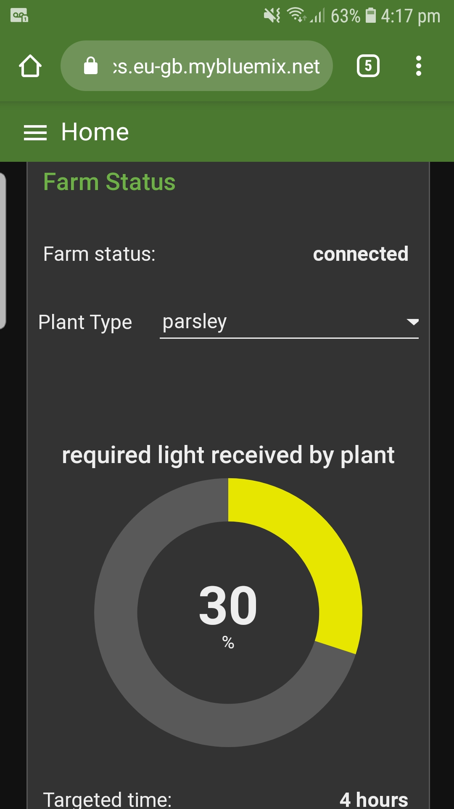  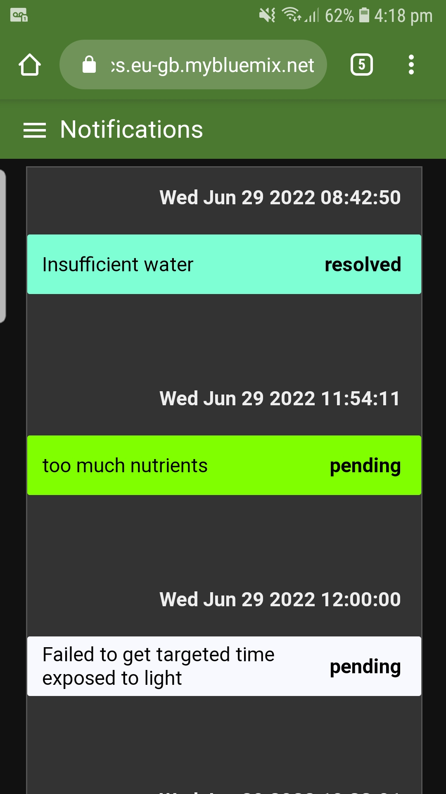 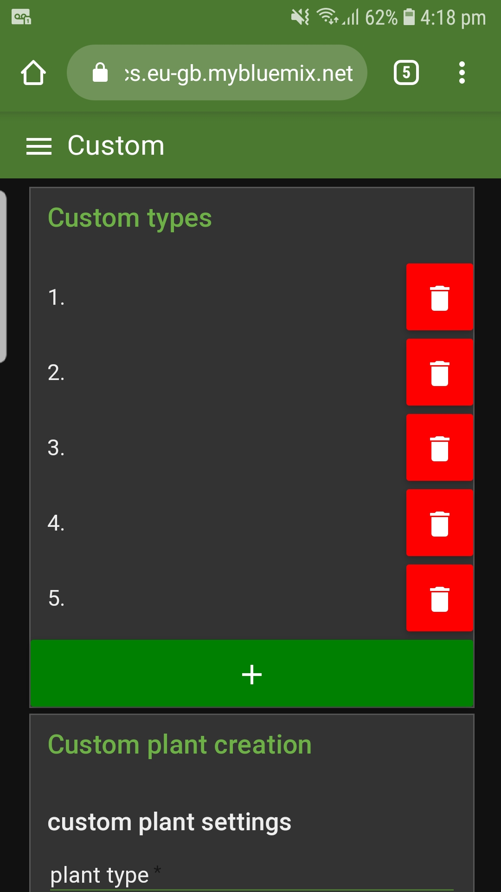  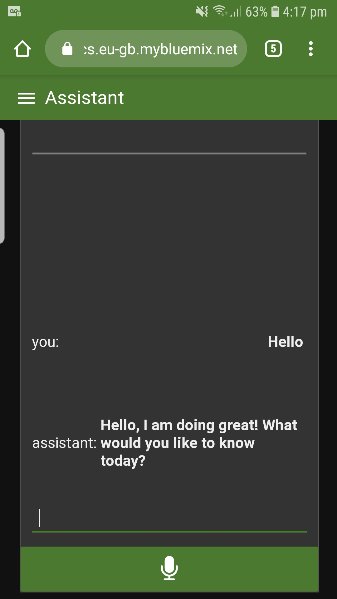 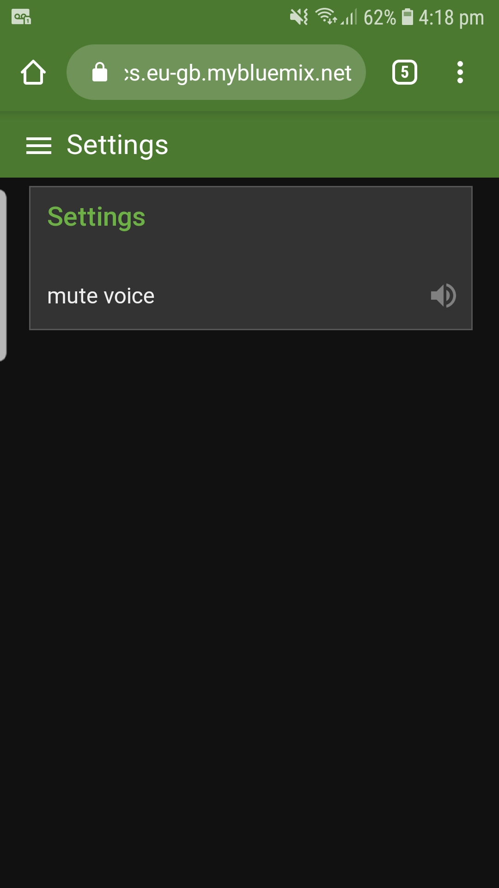
</p>

### Farm Status Displays <a id="Displays"></a>
<p align="center">
    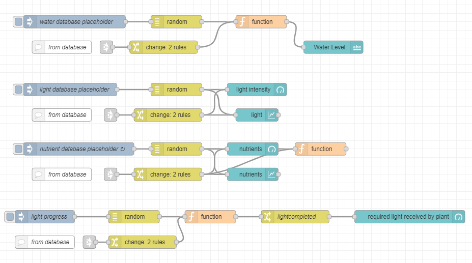
</p>

The above flow creates the displays for the current water level, light intensity, nutrient level and duration of light of the farm. There are "inject" and "random" nodes which are used as placeholders for the database during testing, and link nodes which create the connection to the http request flow to get data from the database.

### Notifications <a id="Notifications"></a>
<p align="center">
    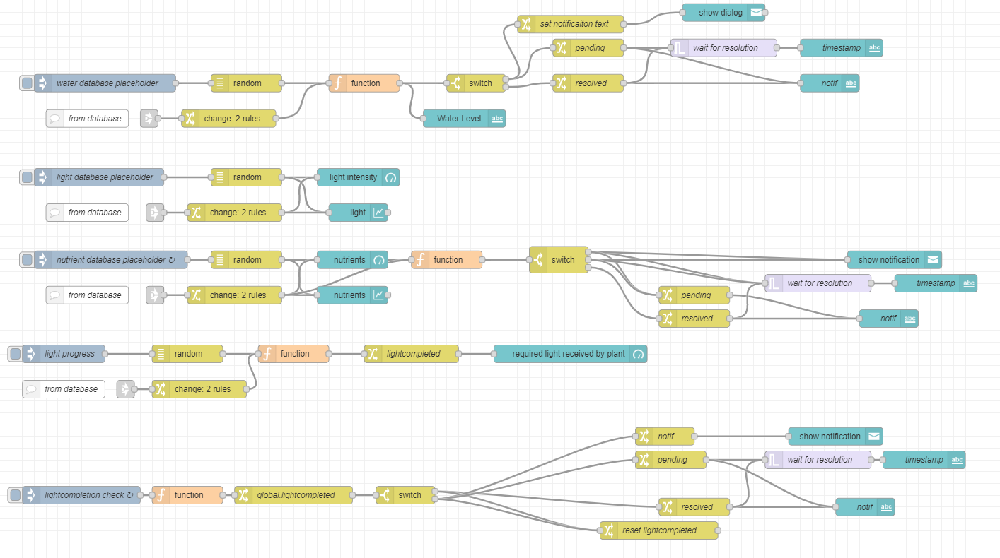
</p>

The above flow adds notifications to the previous farm status nodes, using the javascript in the "function" nodes alongside the "switch" nodes to create the notification logic, resulting in pop-up notifications and a notification log as shown in the ui images above. The light intensity does not have notifications because light intensity control has not been implemented in the raspberry pi, and the duration of light notification logic is different, because it checks every 24hours if the necessary light has been given to the plant rather than notifying the current condition of the farm.

### Chat <a id="Chat"></a>
<p align="center">
    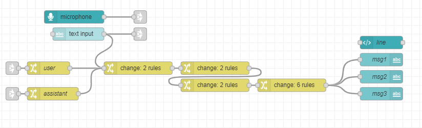
</p>

The above flow creates text and microphone inputs which are then sent to the voice assistant to get a response, and also creates a log of previous messages as shown in the ui image above. 

<p align="center">
    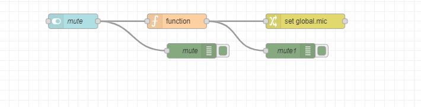
</p>

The above flow creates a button input for enabling or disabling the speaker when using the chat.

### Custom Types <a id="Custom"></a>
<p align="center">
    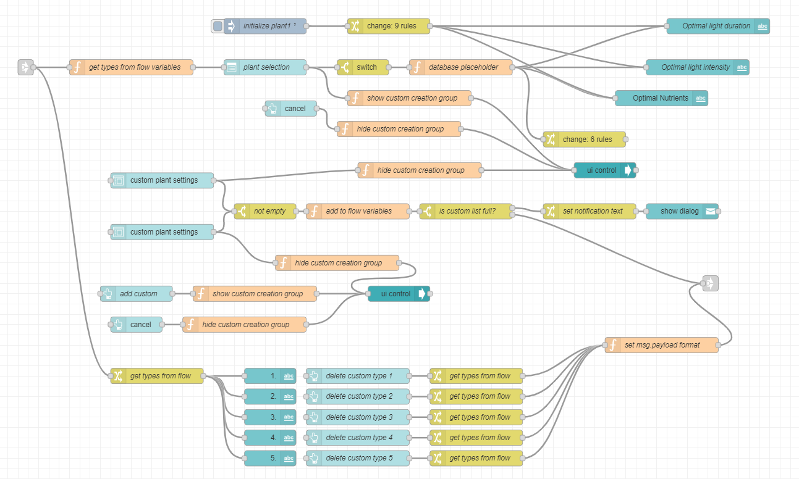
</p>


The above flow contains a "plant selection" list where users can choose one of the preset plant types and hence the farms optimal values. These values are then displayed on the Home page as text outputs alongside the farm status. There are also 2 "custom plant settings" forms which users can use to add custom plant types and their optimal values. After adding custom plants types, they are saved as flow variables, added to the plant list, and displayed in the custom tab where they can also be deleted. The flow also contains some "ui control" nodes which are used to hide or show the forms so the dashboard is less clutered.

### Connection Status <a id="Connection"></a>
<p align="center">
    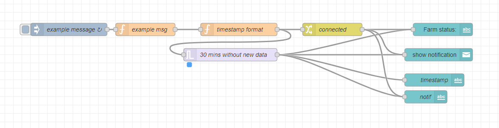
</p>

The above flow is used to check the connection status to the database and farm, if data hasnt been received in 30 minutes, a disconnected notification is triggered, if data is received after, the status is changed to connected.

### CSS <a id="CSS"></a>
```
<style>
    .blue {
        background-color: #7FFFD4 !important;
        color: black !important;
    }
    .green {
        background-color: #7FFF00 !important;
        color: black !important;
    }
    .yellow {
        background-color: #FFD700 !important;
        color: black !important;
    }
    .white{
        background-color: #F8F8FF !important;
        color: black !important;
    }
    .crimson{
        background-color: #DC143C !important;
        color: black !important;
    }
    .assist_msg{
        background-color: #ADD8E6 !important;
        color: black !important;
    }
    .usr_msg{
        background-color: #ADD8E6 !important;
        color: black !important;
    }
    .text_border{
        border-top: 2px green !important;
    }
    .welcome{
        color: #228B22 !important;
        font-size: 150% !important;
        font-family: "Times New Roman" !important;
    }

</style>
```

A html template node is created with the above CSS code which is applied to the different displays to improve the dashboard.

## Voice Assistant <a id="Assistant"></a>

<p align="center">
    
</p>

IBM's Speech-to-Text, Text-to-Speech and Watson Assistant are used to build the voice recognition system. 

### Speech-to-Text <a id="Speech-to-Text"></a>
IBM Speech-to-Text is an API cloud service that utilises AI-powered speech recognition and transcription to convert speech to text. The language chosen is English but it is also possible to choose other languages such as Arabic, French and Korean. 

### Text-to-Speech <a id="Text-to-Speech"></a>
IBM Text-to-Speech is an API cloud service that allows you to convert text to speech using natural-sounding voices. Male or female voices can be chosen.

### Watson Assistant <a id="Watson Assistant"></a>
IBM Watson Assistant uses artificial intelligence to formulate fast, appropriate and accurate responses across any application. By detecting the user's intents, the virtual agent can carry out actions that can be set within the workspace such as responding using dialog that was preset. The main intents for this system are water, light, nutrients and condition as the main application for thie voice recognition feature is for the user to understand the condition of the plants. Possible user examples are added for each intent.

<p align="center">
    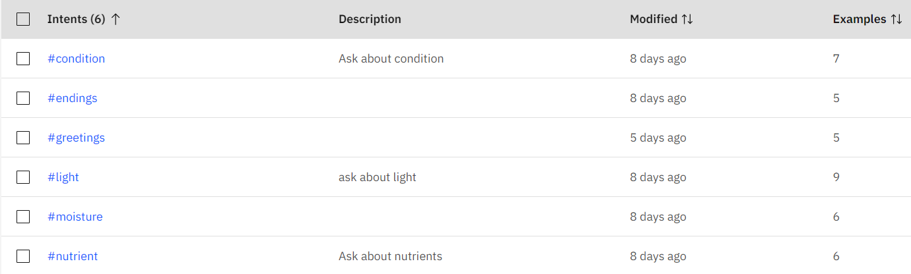
</p>

In the Node-RED flow, user intents are extracted from the Watson Assistant. Based on the intent, the relevant sensor value is extracted from the database and compared against the optimal threshold. For instance, if the user wants to check the light level of the LED lights, the intent 'light' will be detected by Watson Assistant and hence the latest light sensor value is retrieved from the database and checked against the optimal light level needed by the particular type of plant. An appropriate response is given depending on whether there is enough light.

## Integration <a id="Integration"></a>

### Database <-> Pi <a id="D2P"></a>

### Database <-> Node-red <a id="D2P"></a>
<p align="center">
    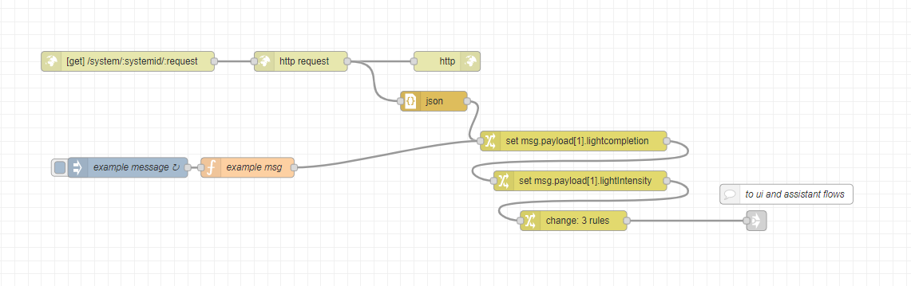
</p>

Http request...


### UI <-> Voice Assistant <a id="U2V"></a>
<p align="center">
    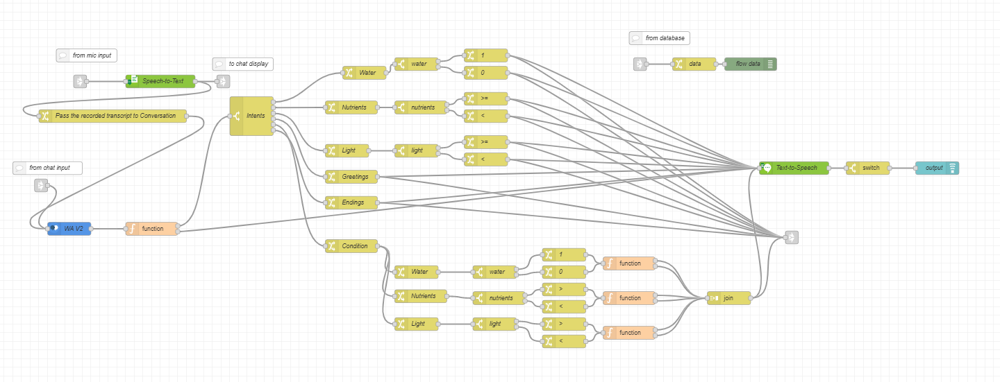
</p>

Nodes for IBMs cloud services are available on node-red, the service credentials are entered into the nodes which are then used to pass the user chat inputs to the speech-to-text and watson assitant to decipher the message's intent, which then replies the user with the farm conditions comparing the data from the database and the optimal values, the reply is in the form of text and also through the speaker using speech-to-text. 

## Sustainability and Ethical Report <a id="Sustainability"></a>
HomeGrow integrates AI and IoT technology into a traditional vertical hydroponics farming system. Our product is intended to meet the needs of those living in LEDCs without reliable access to drinking water. 

Our product provides the following solutions for sustainability.
First, we designed a system that recycles water. Water is pumped through the water pump from the reservoir into the pipes. The water then flows through the plant holders back into the reservoir. Since water access is not guaranteed in LEDCs, reducing the usage is water benefits the farmers greatly.

Second, our system uses a special growing material, rockwool, rather than soil to maximize water savings. Furthermore, our self-controlled design makes it possible for a minimum number of farmers to be responsible for the plants. They will only need to top up water and nutrients into the reservoir and nutrients container. 
On the other hand, to increase crop yield, we use special fertilizer to make plants grow four times faster. In addition, we use a vertical design to save space in order to plant more plants in a limited area. A vertical hydroponics design also helps to reduce the chances of plant diseases, thus increasing the rate of plants surviving to harvest.

By increasing crop yield, the government will not only be able to solve the problem of food shortage but will also be able to sell crops to other countries in order to make money and improve their economic conditions. A country can use the money earned by selling crops to develop its economy. The reduced amount of water and space needed also indicates farmers will have reduced infrastructure and maintenance costs.

The vertical farm is constructed from inexpensive UPVC pipes and electronics. Compared to other current hydroponic systems for sale, our product can be up to two times cheaper, making it more accessible. Furthermore, more pipes can be added easily to upscale the farm. As a result, the cost for a large-scale farm is very reasonable and within the reach of government officials in LEDCs.


## Future Work <a id="Future"></a>
1. Larger frames to support more plants
2. Advanced voice recognition system
3. Integration with weather API
4. Image recognition for plant diseases
5. Sourcing alternatives to UPVC pipes to have a biodegradable system

## Meeting Minutes <a id="Meeting"></a>


## Gantt Chart <a id="Meeting"></a>


